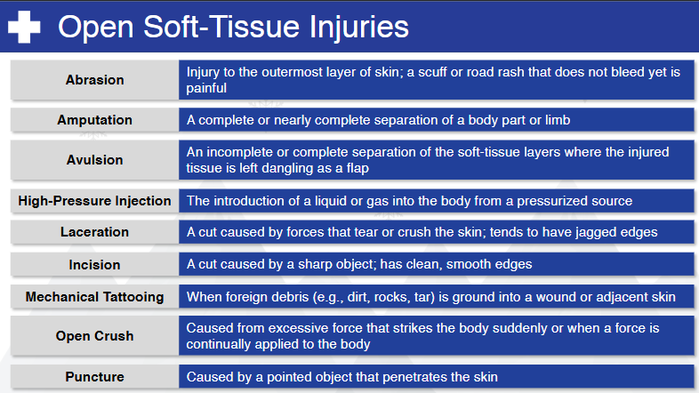
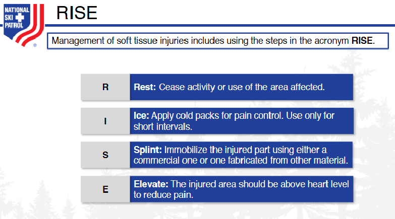

    
# Nsp Oec Training Chapter 19 

## National Ski Patrol - Outdoor Emergency Care chapter 19

    

    
## Table of Contents

- [Solution Overview](#solution-overview)
- [Who will use this ?](#who-can-use)
- [Advantages of Using](#advantages-of-using)
- [Return on Investment (ROI)](#return-on-investment-roi)
- [How it Works](#how-it-works)
- [Conclusion](#conclusion)
- [Getting Started](#getting-started)
- [Solution Features](#solution-features)
- [Code Features](#code-features)
- [Deliverables or Figures](#deliverables-or-figures)
- [Contact Information](#contact-information)

## Chapter 19: Soft-Tissue Injuries and Burns 

1. List the four functions of the skin.
2. List the layers of the skin
3. Explain the difference between arterial and venous bleeding.
4. Explain how to access a soft-tissue injury.
5. Describe and demonstrate care for closed soft-tissue injuries.
6. Describe and demonstrate care for open soft-tissue injuries.
7. Explain the difference between thermal, chemical, electrical, lightning, and radiation burns, and the treatment for each.
8. Explain how to assess and care for a sunburn, and what SPF means for sun creams.
9. Explain how to assess and care for a burn.
10. Explain and describe how to classify burns by depth of injury.
11. Explain and demonstrate the different methods to control bleeding, including application of a tourniquet.
12. Explain the difference between a bandage and a dressing.
13. Describe and demonstrate how to apply a dressing and bandage, including occlusive and stabilizing dressings.
14. Explain which burn patients need to be transferred to a "burn center."
15. Explain how to assess and treat an individual struck by lightning. 

## 19.1 List the four functions of the skin.

The four primary functions of the skin are:

1. **Protection**: The skin acts as a physical barrier, protecting the body from harmful environmental factors such as bacteria, UV radiation, chemicals, and physical injuries.

2. **Regulation**: The skin helps regulate body temperature through sweat production and the dilation or constriction of blood vessels. It also plays a role in maintaining fluid balance and prevents excessive water loss.

3. **Sensation**: The skin contains sensory receptors that allow us to feel touch, pressure, pain, and temperature changes, helping us respond to our environment.

4. **Excretion and Absorption**: The skin excretes waste products such as salts and urea through sweat and can absorb certain substances like medications (through topical applications).

These functions are crucial for maintaining overall health and homeostasis.

## 19.2 List the layers of the skin

The skin is composed of three primary layers:

1. **Epidermis**: The outermost layer that provides a protective barrier. It contains keratin and melanocytes, which give the skin its strength and pigmentation.

2. **Dermis**: The middle layer, containing blood vessels, nerves, hair follicles, and sweat glands. It provides structure and elasticity through collagen and elastin fibers.

3. **Hypodermis (Subcutaneous layer)**: The deepest layer made up of fat and connective tissue. It helps insulate the body and absorb shock, providing cushioning for underlying organs.

These layers work together to protect and support the body.

## 19.3 Explain the difference between arterial and venous bleeding.

**Arterial bleeding** and **venous bleeding** differ in the source, appearance, and severity:

1. **Arterial Bleeding**:
   - **Source**: Comes from arteries, which carry oxygen-rich blood away from the heart.
   - **Appearance**: Bright red in color due to the high oxygen content.
   - **Flow**: Blood typically **spurts** with each heartbeat due to the higher pressure in arteries, making it more difficult to control.
   - **Severity**: Generally more severe and life-threatening because of the rapid blood loss.

2. **Venous Bleeding**:
   - **Source**: Comes from veins, which carry oxygen-depleted blood back to the heart.
   - **Appearance**: Darker red in color due to lower oxygen levels.
   - **Flow**: Blood flows steadily and **slowly**, without the spurting seen in arterial bleeding, as venous pressure is lower.
   - **Severity**: While it can still be dangerous, venous bleeding is typically easier to control than arterial bleeding.

Both types of bleeding require prompt care, but arterial bleeding demands more urgent attention due to the high risk of rapid blood loss.

## 19.4 Explain how to access a soft-tissue injury.

To assess a **soft-tissue injury**, follow these key steps to identify the severity and provide appropriate care:

### 1. **Scene Safety and Initial Assessment**:
   - Ensure the environment is safe for both you and the patient.
   - Introduce yourself, ask for consent to provide care, and assess the patient’s overall condition (e.g., level of consciousness, pain).

### 2. **Visual Inspection**:
   - **Expose the area**: Gently remove or cut away clothing if necessary to inspect the injury.
   - Look for signs of **bruising**, **swelling**, **discoloration**, **bleeding**, or **deformities**.
   - Assess the size and depth of any open wounds, such as lacerations, punctures, abrasions, or avulsions.

### 3. **Palpation**:
   - **Gently palpate** the area around the injury to assess for tenderness, warmth, and swelling.
   - Feel for any **crepitus** (a grating sensation indicating a fracture or bone damage beneath the soft tissue).
   - Ask the patient if they experience pain upon touch or movement.

### 4. **Assess for Bleeding**:
   - Determine if the injury involves **arterial, venous, or capillary bleeding**.
   - Control any active bleeding using **direct pressure**, **elevation**, or a **tourniquet** (if appropriate for severe arterial bleeding).

### 5. **Check Circulation, Sensation, and Movement (CSM)**:
   - Assess **circulation**: Check the pulse below the injury site (e.g., in the extremities) to ensure adequate blood flow.
   - Assess **sensation**: Ask if the patient can feel touch or pressure around and below the injury site.
   - Assess **movement**: Ask the patient to move the affected body part (if possible) or observe for any limitations in movement due to pain, swelling, or structural damage.

### 6. **Identify Signs of Infection** (for older or untreated wounds):
   - Look for **redness**, **warmth**, **pus**, or **fever**, which could indicate an infection.

### 7. **Evaluate for Associated Injuries**:
   - Consider that soft-tissue injuries can be associated with **underlying fractures** or **joint injuries**.
   - Assess for any nearby **bone deformities** or **dislocations** that may have occurred in conjunction with the soft-tissue damage.

### 8. **Determine Severity**:
   - Assess whether the injury is **superficial** (like minor bruises or abrasions) or **severe** (like deep lacerations, avulsions, or crush injuries).
   - Determine if the injury is life-threatening or if the patient can be treated on-site or needs advanced medical attention.

### 9. **Document Findings**:
   - Record the location, type, size, and severity of the injury, as well as any changes in the patient's condition or complaints of pain.

After the assessment, provide appropriate care, which may include wound cleaning, dressing, splinting, or seeking advanced medical care depending on the severity of the injury.

## 19.5 Describe and demonstrate care for closed soft-tissue injuries.

**Closed soft-tissue injuries**, such as **bruises, contusions, or hematomas**, result from trauma without breaking the skin. Here's how to care for these injuries:

### **1. Scene Safety and Initial Assessment**:
   - Ensure the scene is safe for you and the patient.
   - Assess the patient for any other life-threatening injuries, especially if the trauma was significant (e.g., a fall or collision).

### **2. Visual Inspection and Palpation**:
   - Inspect the area for signs of **swelling, discoloration (bruising), or deformity**.
   - Gently palpate the injured area to assess for tenderness and swelling. Check for any associated pain that could indicate a deeper injury (e.g., fractures).

### **3. Apply the R.I.C.E. Protocol**:
   The **R.I.C.E.** protocol is the most common method of caring for closed soft-tissue injuries:
   - **R – Rest**: Advise the patient to stop using the injured area to prevent further damage.
   - **I – Ice**: Apply an ice pack or cold compress to the injured area for **15-20 minutes** at a time. This helps reduce swelling, inflammation, and pain. Ensure a barrier (e.g., cloth) is between the ice and the skin to avoid frostbite.
   - **C – Compression**: Use an elastic bandage or wrap to apply **gentle compression** to the area. This helps control swelling and provides support. Ensure it’s not too tight, as it can impair circulation.
   - **E – Elevation**: Elevate the injured part above heart level, if possible, to reduce swelling and promote circulation.

### **4. Monitor Circulation, Sensation, and Movement (CSM)**:
   - **Circulation**: Check for a pulse below the injured area to ensure proper blood flow.
   - **Sensation**: Ask if the patient feels normal sensation in the area or if there’s numbness or tingling.
   - **Movement**: Check if the patient can move the affected body part without increased pain or difficulty.

### **5. Pain Management**:
   - If allowed, the patient may take over-the-counter pain medications (e.g., ibuprofen) to reduce pain and inflammation.
   
### **6. Reassess for Deeper Injuries**:
   - While treating the visible signs, continue to monitor for more serious conditions like **internal bleeding, fractures**, or **compartment syndrome**, especially if the swelling or pain worsens significantly.

### **7. Patient Education**:
   - Advise the patient to continue the **R.I.C.E.** protocol at home for the next 24-48 hours.
   - Caution against overusing the injured area until it has healed.

### **Demonstration Example**:
1. **Apply Ice**: After assessing the patient, you place an ice pack on the injured area, ensuring a cloth is between the skin and ice.
2. **Wrap with Compression**: Use an elastic bandage to gently wrap the injury, applying firm but not too tight pressure.
3. **Elevate the Limb**: Help the patient elevate the injured part on a pillow or nearby support to reduce swelling.
4. **Reassess Circulation**: After compression, you check the patient's circulation by feeling for a pulse below the injury and ensuring they can still feel and move the area.

These steps help manage closed soft-tissue injuries effectively and promote healing while reducing the risk of complications.

## 19.6 Describe and demonstrate care for open soft-tissue injuries.

**Open soft-tissue injuries** involve a break in the skin, exposing underlying tissues. Types include **abrasions, lacerations, punctures, avulsions**, and **amputations**. Here’s how to provide care for these injuries:

### **1. Scene Safety and Initial Assessment**:
   - **Ensure scene safety**: Make sure it's safe for both you and the patient.
   - **Wear gloves or protective equipment** to avoid contact with blood.
   - Assess the overall condition of the patient, looking for signs of shock or other serious injuries.

### **2. Control Bleeding**:
   - **Direct Pressure**: Apply firm pressure with a sterile dressing or clean cloth to stop bleeding. If bleeding is severe, continue applying pressure without lifting the bandage.
   - **Elevation**: If possible, raise the injured area above the level of the heart to slow blood flow.
   - **Pressure Bandage**: Once bleeding is controlled, secure the dressing with a bandage, applying additional pressure if needed.
   - **Tourniquet**: If direct pressure and elevation are insufficient to control life-threatening bleeding (especially in the case of amputations), apply a tourniquet above the injury site, following proper guidelines.

### **3. Clean the Wound (if Minor)**:
   - **For minor injuries** (e.g., abrasions or shallow lacerations), gently clean the wound with clean water or saline to remove dirt and debris.
   - Avoid cleaning deep wounds in the field; just cover them with a sterile dressing.

### **4. Apply Sterile Dressing**:
   - Cover the wound with a **sterile gauze pad** or dressing.
   - Secure the dressing with an **elastic bandage** or tape to hold it in place, ensuring it’s not too tight to cut off circulation.

### **5. Monitor Circulation, Sensation, and Movement (CSM)**:
   - **Circulation**: Check for a pulse below the injury site.
   - **Sensation**: Ask the patient if they feel numbness, tingling, or normal sensation below the injury.
   - **Movement**: Ensure the patient can move the affected limb without severe pain or difficulty.

### **6. Manage Shock**:
   - **Position the patient** on their back if they show signs of shock (pale, cool, clammy skin, rapid pulse, confusion).
   - Keep them warm with a blanket.
   - Encourage **calm, deep breathing**, and monitor their condition until help arrives.

### **7. Special Care for Specific Injuries**:
   - **Avulsion**: If part of the skin is torn away but still attached, gently place the skin back in its normal position before covering with a dressing.
   - **Amputation**: For amputated body parts, wrap the severed part in a sterile dressing, place it in a plastic bag, and keep it cool (but do not place it directly on ice). Transport it with the patient to the hospital.

### **8. Reassess and Monitor**:
   - Frequently reassess the injury for changes in bleeding, infection, or circulation.
   - Continue to monitor the patient for signs of shock, and ensure they remain stable during transport or while waiting for emergency medical services (EMS).

### **9. Documentation**:
   - Document the time of injury, type of wound, any first aid performed (such as applying a tourniquet), and the patient’s response to care.

### **Demonstration Example**:
1. **Control Bleeding**: You apply direct pressure to a laceration on the forearm using a sterile gauze pad. The bleeding slows, and you secure the gauze with a pressure bandage.
2. **Clean and Dress Minor Wounds**: If it's a minor abrasion, clean the wound with clean water, apply an antibiotic ointment (if available), and cover it with a sterile dressing.
3. **Monitor CSM**: After applying a bandage, check that the patient has a pulse below the injury, ask if they can feel sensations, and ensure they can move their fingers.
4. **Manage Shock**: Keep the patient warm and calm, and prepare for transport if necessary.

These steps help to minimize further injury, control infection, and stabilize the patient until they can receive advanced medical care.

## 19.7 Explain the difference between thermal, chemical, electrical, lightning, and radiation burns, and the treatment for each.

Here’s an explanation of the different types of burns—**thermal, chemical, electrical, lightning, and radiation burns**—and their appropriate treatments:

### **1. Thermal Burns**:
   - **Cause**: Result from exposure to heat sources, such as fire, hot liquids, steam, or hot surfaces.
   - **Symptoms**: Redness, blistering, swelling, or charred skin depending on the severity (classified as first-, second-, or third-degree burns).
   - **Treatment**:
     - **Cool the burn**: Immediately cool the burn with cool (not cold) water for at least 10-15 minutes. Do not use ice.
     - **Remove clothing and jewelry** around the burn, but **do not remove anything** stuck to the skin.
     - **Cover the burn** with a sterile, non-stick dressing or clean cloth.
     - **Treat for shock**: If the burn is severe, lay the person down and elevate their legs.
     - **Seek medical attention** for large or deep burns, or burns on sensitive areas like the face, hands, feet, or groin.

### **2. Chemical Burns**:
   - **Cause**: Occur from contact with corrosive substances, such as acids, alkalis, or industrial chemicals.
   - **Symptoms**: Redness, swelling, blisters, or discolored skin, along with potential pain and irritation.
   - **Treatment**:
     - **Flush the area with water**: Immediately rinse the affected area with large amounts of running water for at least 20 minutes to remove the chemical. Be cautious not to spread the chemical.
     - **Remove contaminated clothing or jewelry**.
     - **Do not apply ointments or creams** unless advised by a healthcare provider.
     - **Seek medical attention** for chemical burns, especially if the burn is deep, widespread, or caused by a strong chemical like lye or sulfuric acid.
     - **Special care for eyes**: If the chemical gets into the eyes, rinse with clean water or saline solution for at least 15-20 minutes and seek emergency care.

### **3. Electrical Burns**:
   - **Cause**: Result from contact with electrical currents, which can cause internal and external damage.
   - **Symptoms**: Entry and exit wounds may be visible on the skin, but internal damage to tissues, muscles, and organs may not be immediately apparent. Symptoms may include muscle spasms, heart arrhythmias, and unconsciousness.
   - **Treatment**:
     - **Ensure the source of electricity is turned off** before touching the patient.
     - **Check for breathing and pulse**: Electrical burns often cause cardiac or respiratory arrest, so perform CPR if necessary.
     - **Treat visible burns** with cool water and cover with a sterile dressing, but **do not cool the body excessively**.
     - **Monitor for shock**: Keep the patient warm and calm, and treat for shock if needed.
     - **Seek immediate medical attention** for all electrical burns, as internal injuries may not be visible but can be life-threatening.

### **4. Lightning Burns**:
   - **Cause**: Result from a direct strike or secondary contact with a lightning bolt.
   - **Symptoms**: May include burns at the entry and exit points, as well as muscle spasms, heart arrhythmias, or even cardiac arrest. Additional symptoms may include confusion, temporary paralysis, or hearing/vision problems.
   - **Treatment**:
     - **Ensure scene safety** before approaching the patient.
     - **Perform CPR if necessary**: Lightning strikes often cause cardiac arrest, so immediate CPR may be required.
     - **Treat visible burns**: Cool the burn area with water and cover with a sterile dressing.
     - **Monitor for shock and other injuries**, such as fractures or blunt trauma from being thrown by the strike.
     - **Seek immediate medical attention**, as lightning strikes can cause long-term neurological or cardiovascular damage.

### **5. Radiation Burns**:
   - **Cause**: Result from prolonged exposure to radiation sources, such as the sun (sunburn), medical radiation (X-rays, radiation therapy), or industrial radiation sources.
   - **Symptoms**: Redness, blistering, peeling, and pain for mild burns, while severe burns can result in tissue damage and increased cancer risk.
   - **Treatment**:
     - **For sunburns**: Cool the area with water, apply moisturizing lotions or aloe vera, and keep the skin hydrated. Avoid further sun exposure.
     - **For medical radiation burns**: Follow the treatment plan provided by healthcare providers, which may include topical creams, wound care, or medication to manage symptoms.
     - **Cover the burned area** with a sterile, non-stick dressing if the skin is open or blistered.
     - **Seek medical attention** for severe or ongoing radiation burns, especially those caused by medical treatments or industrial accidents.

### **Summary**:
Each type of burn requires prompt and specific care, depending on its cause:
- **Thermal burns**: Cool with water, cover, and monitor for shock.
- **Chemical burns**: Flush with water, remove contaminated materials, and seek medical attention.
- **Electrical burns**: Ensure safety, treat for possible cardiac arrest, and seek immediate medical help.
- **Lightning burns**: Provide CPR if needed, treat burns, and monitor for internal injuries.
- **Radiation burns**: Cool the skin, apply soothing lotions, and seek medical advice if severe. 

In all cases of severe burns, medical attention is crucial to prevent complications and promote healing.

## 19.8 Explain how to assess and care for a sunburn, and what SPF means for sun creams.

### **Assessing a Sunburn**:
1. **Visual Inspection**:
   - Look for **redness, swelling, and tenderness** of the skin, which are typical of mild sunburns (first-degree burns).
   - For more severe sunburns (second-degree burns), check for **blisters**, deeper redness, and more intense pain.
   - Check the patient's general condition for signs of **dehydration**, such as dry mouth, dizziness, or fatigue.

2. **Ask the Patient About Symptoms**:
   - Inquire about **pain**, itching, or **burning sensations**.
   - Ask if they are experiencing any **systemic symptoms**, such as fever, chills, nausea, or headaches, which could indicate sun poisoning.

3. **Determine the Extent of the Burn**:
   - Assess how much of the body is affected. Larger areas or burns in sensitive spots like the face, neck, or chest may require medical attention.

### **Caring for a Sunburn**:
1. **Cool the Burn**:
   - Gently cool the skin with **cool (not cold) water** or apply a cold compress for 10-15 minutes to help reduce pain and swelling.
   - **Avoid using ice** directly on the skin, as it can cause further damage.

2. **Hydrate the Skin**:
   - Apply **moisturizing lotions or gels** (such as aloe vera) to soothe the skin and prevent peeling.
   - Avoid ointments with **petroleum** or heavy oils, as they can trap heat in the skin.

3. **Rehydrate the Body**:
   - Encourage the patient to drink plenty of water to **rehydrate**, as sunburns can cause fluid loss and dehydration.

4. **Pain Relief**:
   - Over-the-counter **pain relievers** such as ibuprofen or acetaminophen can help reduce pain and inflammation.

5. **Protect the Skin**:
   - Advise the patient to stay out of the sun while the burn heals. Cover the burned area with loose, breathable clothing if they must go outdoors.

6. **Monitor for Infection**:
   - If blisters develop, avoid popping them to reduce the risk of infection. If a blister does break, clean the area with water and apply a sterile dressing.
   - Watch for signs of infection, such as **increased redness, swelling, or pus**.

7. **Seek Medical Attention**:
   - Seek professional care if the sunburn is severe (large blistering areas), if the patient shows signs of sun poisoning (fever, nausea), or if dehydration persists.

### **What SPF Means for Sun Creams**:
**SPF** stands for **Sun Protection Factor**. It measures how well a sunscreen protects the skin from **UVB rays**, which are the primary cause of sunburn and contribute to skin cancer.

- **SPF 15**: Filters about **93%** of UVB rays.
- **SPF 30**: Filters about **97%** of UVB rays.
- **SPF 50**: Filters about **98%** of UVB rays.

The number indicates how much longer it will take for unprotected skin to burn compared to skin with sunscreen. For example, SPF 30 means it will take **30 times longer** for skin to burn than without protection.

### Important Notes About SPF:
- **Reapplication**: Sunscreen should be reapplied **every 2 hours**, or more often if swimming or sweating, regardless of the SPF.
- **Broad-Spectrum**: Look for sunscreens labeled **"broad-spectrum,"** as these protect against both **UVA** (aging and long-term skin damage) and **UVB** (burning) rays.
- **Water Resistance**: Water-resistant sunscreens last longer when sweating or swimming, but still need reapplication after 40 or 80 minutes in water.

In summary, SPF measures how well sunscreen protects against UVB rays, and regular reapplication is essential for effective sun protection.

## 19.9 Explain how to assess and care for a burn.

### **Assessing a Burn**:
When assessing a burn, it’s important to determine its **severity**, **depth**, and **extent**. Follow these steps:

1. **Identify the Cause**:
   - Determine if the burn was caused by **thermal**, **chemical**, **electrical**, or **radiation** (e.g., sunburn) exposure. This can influence how the burn is treated.

2. **Assess the Depth of the Burn**:
   Burns are classified into three types based on their depth:
   - **First-degree burns (superficial)**: Affect only the outer layer of the skin (epidermis). The skin is red, painful, and may be slightly swollen, but there are no blisters.
   - **Second-degree burns (partial thickness)**: Affect both the outer layer (epidermis) and the underlying layer (dermis). The skin appears red, blistered, and very painful.
   - **Third-degree burns (full thickness)**: Extend through all layers of the skin and may affect underlying tissues. The skin may look white, charred, or leathery. Third-degree burns may be painless initially because the nerves are damaged.

3. **Estimate the Extent of the Burn**:
   - Use the **"Rule of Nines"** to estimate the percentage of the body affected by the burn. For adults, each arm is 9%, each leg is 18%, the torso is 36% (front and back), the head is 9%, and the genital area is 1%.
   - Burns that cover more than **10% of the body** or are located on critical areas (face, hands, feet, or groin) are considered serious.

4. **Assess the Location**:
   - Burns to the **face, neck, chest, or airways** are especially dangerous as they can impact breathing.
   - Burns on the **joints** (hands, feet, elbows, etc.) may cause long-term mobility issues and should be treated as serious.

5. **Check for Associated Injuries**:
   - Assess for other injuries, such as **inhalation injury** (in cases of fire), **shock**, or other trauma.

### **Caring for a Burn**:
Burn care depends on the **type** and **severity** of the burn. Follow these steps:

#### **1. Stop the Burning Process**:
   - **Thermal Burns**: Remove the source of heat. If clothing is on fire, stop the patient from running, and use **"stop, drop, and roll"**. Cool the burn with **cool (not cold) water** for 10-15 minutes. Avoid ice, as it can cause further damage.
   - **Chemical Burns**: Flush the affected area with **copious amounts of water** for at least 20 minutes to remove the chemical. Be careful not to spread the chemical to other areas.
   - **Electrical Burns**: **Turn off the power source** before touching the patient to prevent electrical shock. Afterward, treat for burns and assess for internal injuries.
   - **Radiation Burns (Sunburns)**: Move the person out of the sun, and cool the skin with water or cool compresses.

#### **2. Cool the Burn**:
   - For all burn types (except for electrical burns), cool the burn with **cool water** for 10-15 minutes to reduce pain and swelling.
   - Avoid using ice, as it can cause further tissue damage.

#### **3. Cover the Burn**:
   - **First-degree burns**: Apply an **aloe vera** lotion or moisturizing cream to soothe the skin.
   - **Second-degree burns**: Cover the burn with a **sterile, non-stick dressing** or clean cloth to protect the blistered area from infection. Avoid popping blisters.
   - **Third-degree burns**: **Do not apply creams or lotions**. Cover the burn with a loose, sterile dressing or clean cloth, and seek emergency medical care immediately.

#### **4. Prevent Infection**:
   - For more serious burns, keep the burn area clean and dry to prevent infection. Avoid applying any ointments, butter, or oils to deep burns.
   - If blisters form, **do not pop them**, as this increases the risk of infection.

#### **5. Manage Pain**:
   - Over-the-counter pain relievers like **ibuprofen** or **acetaminophen** can help manage pain.
   - If the burn is severe or involves large areas, the patient should receive professional medical care for pain management.

#### **6. Treat for Shock**:
   - Burns can lead to **shock**, especially large or deep burns. To treat for shock:
     - Lay the person flat on their back and **elevate their legs** (if no other injuries).
     - Keep the patient **warm** by covering them with a blanket.
     - **Monitor breathing and consciousness** and reassure the patient.

#### **7. Seek Medical Attention**:
   - Seek immediate medical attention if:
     - The burn is **third-degree** or covers more than 10% of the body.
     - The burn is on the **face, hands, feet, groin, or over major joints**.
     - There are signs of **infection** (increased pain, swelling, pus, or fever).
     - The burn was caused by **chemicals**, **electricity**, or a **fire**.
     - The patient shows signs of **shock** (pale skin, rapid heartbeat, confusion).

### **Important Don’ts**:
- **Don’t use ice**: It can worsen tissue damage.
- **Don’t apply butter or ointments** to severe burns.
- **Don’t break blisters**, as this increases the risk of infection.
  
### **Conclusion**:
Assessing and caring for a burn requires understanding its cause, depth, and extent. Cooling the burn, covering it properly, preventing infection, and managing pain are critical first steps. For serious burns, always seek medical attention immediately.

## 19.10 Explain and describe how to classify burns by depth of injury.

Burns are classified by **depth of injury**, which reflects how deeply the skin and underlying tissues are affected. The three main categories are **first-degree (superficial)**, **second-degree (partial thickness)**, and **third-degree (full thickness)** burns. Each classification has distinct characteristics based on how much of the skin and tissues are damaged.

### **1. First-Degree Burns (Superficial Burns)**:
   - **Depth of Injury**: Involves only the outermost layer of skin, the **epidermis**.
   - **Appearance**: The skin is **red, dry, and painful**. There is no blistering. The area may become slightly swollen.
   - **Symptoms**: Pain, tenderness, and minor swelling are common. The burn site may be sensitive to touch or heat.
   - **Healing**: Typically heals within **3 to 7 days** without scarring.
   - **Example**: **Sunburn** or a minor scald from hot water.
   
   **Care**:
   - Cool the burn with water.
   - Apply soothing aloe vera or lotion.
   - Keep the area protected from further irritation.

### **2. Second-Degree Burns (Partial Thickness Burns)**:
   - **Depth of Injury**: Affects both the **epidermis and part of the dermis**, the second layer of skin.
   - **Appearance**: The skin may be **red, swollen, and blistered**. Blisters can be small or large and filled with fluid. The burn site may appear wet or shiny.
   - **Symptoms**: Severe pain, redness, and swelling. The blistered skin may be very tender and sensitive to the touch.
   - **Healing**: Healing time depends on the extent of the damage to the dermis. **Superficial second-degree burns** may heal in **1-3 weeks** with minimal scarring. **Deeper second-degree burns** may take longer to heal and have a higher risk of scarring.
   - **Example**: A **scalding injury** from hot liquids or contact with a hot object.
   
   **Care**:
   - Cool the burn with water (avoid ice).
   - Cover the burn with a sterile, non-stick dressing.
   - Do not break blisters, as this increases the risk of infection.
   - Seek medical attention if the burn is large or in a sensitive area.

### **3. Third-Degree Burns (Full Thickness Burns)**:
   - **Depth of Injury**: Affects the **epidermis, dermis, and deeper tissues**, including fat, muscle, and sometimes bone.
   - **Appearance**: The skin may appear **white, blackened, brown, or charred**. It may look leathery or waxy. The burn site can be either dry or stiff.
   - **Symptoms**: While third-degree burns are often the most serious, they may be **painless** at first because the nerves in the affected area are damaged or destroyed. However, areas around the burn may be extremely painful.
   - **Healing**: Third-degree burns do not heal on their own and often require **skin grafting** or other surgical interventions. They typically result in significant **scarring** and may affect mobility if joints are involved.
   - **Example**: Burns from **flames**, **electricity**, or prolonged exposure to hot objects.
   
   **Care**:
   - **Seek immediate medical attention**.
   - Do not apply water, ointments, or creams.
   - Cover the burn with a sterile, dry, non-stick dressing.
   - Treat for **shock** if necessary by keeping the person warm and lying down.

### **Other Burn Classifications**:
- **Fourth-degree burns**: Rare but extremely severe, affecting all layers of the skin as well as underlying tissues like muscles, tendons, or bones. These burns often result from prolonged exposure to flames or electricity and are life-threatening. Immediate emergency care is required.

### **Summary of Burn Classifications**:
- **First-degree burns**: Affect only the epidermis. Red, painful, no blisters, and heal quickly without scarring.
- **Second-degree burns**: Affect the epidermis and dermis. Blisters, severe pain, red or swollen appearance, and may heal with some scarring.
- **Third-degree burns**: Affect the epidermis, dermis, and deeper tissues. Charred or leathery skin, may be painless due to nerve damage, and require advanced medical treatment.

Understanding the classification of burns by **depth of injury** helps determine the appropriate level of care and treatment needed for recovery.

## 19.11 Explain and demonstrate the different methods to control bleeding, including application of a tourniquet.

Controlling bleeding is a critical skill in first aid. The goal is to stop the bleeding as quickly as possible to prevent excessive blood loss, shock, or death. The methods to control bleeding include **direct pressure**, **elevation**, **pressure points**, and in severe cases, the use of a **tourniquet**. Here’s a breakdown of each method:

### **1. Direct Pressure**
   - **Description**: This is the primary method to control most bleeding. Applying firm pressure directly over the wound helps to compress the blood vessels and stop blood flow.
   - **How to Apply**:
     1. Place a **sterile dressing** or clean cloth directly on the wound.
     2. Apply **firm, steady pressure** using your hand.
     3. If blood soaks through the dressing, **add more dressings on top** without removing the soaked ones. Keep applying pressure.
     4. Hold the pressure until the bleeding stops or until help arrives.

   - **Demonstration Example**: A cut on the forearm is bleeding profusely. You press a sterile gauze pad firmly over the wound and maintain pressure for several minutes until the bleeding slows.

### **2. Elevation**
   - **Description**: Elevating the injured area above the level of the heart reduces blood flow to the wound, helping to control bleeding.
   - **How to Apply**:
     1. If the injury is on an arm or leg, **raise the limb** above the level of the heart.
     2. Continue to apply **direct pressure** while elevating the limb.
   
   - **Demonstration Example**: After placing pressure on a wound on the leg, you lift the leg onto a chair to keep it elevated while maintaining pressure on the wound.

### **3. Pressure Points**
   - **Description**: If direct pressure and elevation aren’t enough, pressure points can be used to temporarily slow blood flow to a limb by pressing on major arteries that supply blood to the area.
   - **How to Apply**:
     1. For the **arm**, apply pressure to the **brachial artery**, located on the inside of the upper arm between the biceps and triceps.
     2. For the **leg**, apply pressure to the **femoral artery**, located in the groin area where the leg meets the pelvis.
     3. Continue applying **pressure on the artery** while maintaining direct pressure on the wound.

   - **Demonstration Example**: After elevating the leg with a deep wound, you press on the femoral artery in the groin area to further slow the bleeding while waiting for emergency medical help.

### **4. Application of a Tourniquet**
   - **Description**: A tourniquet is used as a last resort when the bleeding is life-threatening and cannot be controlled by other methods, such as in cases of severe limb trauma or amputation.
   - **How to Apply**:
     1. Place the tourniquet **2 to 3 inches above the wound** (but not directly over a joint, such as the elbow or knee).
     2. Tighten the tourniquet until the bleeding **stops**. The patient may feel pain as the tourniquet is tightened, but it’s crucial to stop the blood flow.
     3. Secure the tourniquet in place.
     4. Note the **time** the tourniquet was applied and inform emergency responders.
     5. Once applied, do **not loosen or remove the tourniquet** until professional help arrives, as this can cause further blood loss.

   - **Demonstration Example**: You encounter a severe wound with arterial bleeding on a person’s leg. After direct pressure fails to stop the bleeding, you apply a commercial tourniquet 3 inches above the wound, tighten it until the bleeding stops, and record the time of application.

### **5. Hemostatic Dressings**
   - **Description**: These are special dressings impregnated with substances that help clot blood faster and are useful in areas where a tourniquet cannot be applied (e.g., neck, groin).
   - **How to Apply**:
     1. Place the **hemostatic dressing directly** over the wound.
     2. Apply **direct pressure** for 3-5 minutes.
     3. Secure the dressing in place and continue to monitor the wound.

   - **Demonstration Example**: After finding a deep wound on the shoulder, you pack the wound with a hemostatic dressing and apply firm pressure until the bleeding slows.

---

### **Summary of Bleeding Control Methods**:
1. **Direct Pressure**: First and most effective step for controlling bleeding.
2. **Elevation**: Raise the injured limb above heart level while maintaining pressure.
3. **Pressure Points**: Apply pressure to major arteries to slow bleeding in arms or legs.
4. **Tourniquet**: Used as a last resort for life-threatening bleeding when other methods fail. Properly placed 2-3 inches above the wound.
5. **Hemostatic Dressings**: Advanced dressings to assist clotting, used where a tourniquet isn’t applicable.

Each method should be employed based on the severity and location of the injury, with the tourniquet reserved for the most critical situations where direct pressure alone is insufficient.

## 19.12 Explain the difference between a bandage and a dressing.

The primary difference between a **bandage** and a **dressing** lies in their function and purpose in wound care:

### **1. Dressing**:
   - **Function**: A **dressing** is a sterile material applied directly to a wound to protect it from infection, absorb exudate (fluids), and promote healing.
   - **Purpose**: It **covers the wound** to prevent contamination from dirt, bacteria, and other environmental factors, while also providing a clean environment to promote healing.
   - **Types**: Dressings can include sterile gauze pads, adhesive pads, and specialized dressings such as **hydrocolloid** or **foam dressings**.
   - **Example**: A sterile gauze pad applied to a cut or a specialized adhesive dressing used for post-surgical wounds.

### **2. Bandage**:
   - **Function**: A **bandage** is used to **secure a dressing** in place and may also provide support, pressure, or immobilization to the injured area.
   - **Purpose**: It **holds the dressing** over the wound and helps maintain pressure to control bleeding or reduce swelling. Bandages also protect the wound and dressing from becoming dislodged.
   - **Types**: Common bandages include **elastic bandages** (e.g., Ace wraps), **triangular bandages**, and **adhesive bandages** (e.g., Band-Aids).
   - **Example**: An elastic bandage wrapped around an arm to hold a sterile dressing in place on a cut.

### **Summary**:
- **Dressing**: Applied directly to the wound to protect and promote healing.
- **Bandage**: Used to secure the dressing and provide additional support or pressure.

In wound care, the **dressing** addresses the wound itself, while the **bandage** ensures that the dressing stays in place and provides external support.

## 19.13 Describe and demonstrate how to apply a dressing and bandage, including occlusive and stabilizing dressings.

Applying a **dressing** and **bandage** is an important step in wound care to protect the injury, prevent infection, and promote healing. Here's how to apply different types of dressings and bandages, including **occlusive** and **stabilizing** dressings:

### **1. Standard Dressing and Bandage Application**:

#### **A. Apply a Sterile Dressing**:
1. **Wash your hands**: Before handling the dressing, wash your hands or wear gloves to maintain cleanliness and prevent infection.
2. **Expose the wound**: If clothing or other materials are covering the wound, gently remove them.
3. **Clean the wound**: If necessary and appropriate, clean the wound with clean water or saline solution to remove any debris.
4. **Place the sterile dressing**: 
   - Take a **sterile dressing** (e.g., gauze pad) and place it **directly over the wound**. Ensure the dressing covers the entire wound, and make sure not to touch the part of the dressing that will contact the wound.
   - For large wounds, you may need multiple dressings.

#### **B. Secure with a Bandage**:
1. **Choose a bandage**: Use a **roller bandage** or elastic bandage to secure the dressing in place.
2. **Wrap the bandage**: 
   - Start **just below the wound** and work upward, wrapping the bandage around the dressing.
   - Make sure the bandage is **snug but not too tight** to restrict blood flow.
   - Continue wrapping to cover the dressing entirely and provide additional support. 
3. **Tie or tape the bandage**: Once wrapped, tie the bandage securely or use adhesive tape to keep it in place. Ensure the dressing stays clean and doesn't slip.

#### **C. Check Circulation**:
   - After applying the bandage, check the circulation beyond the wound site (e.g., fingers or toes) by ensuring the skin color remains normal and there's no numbness or tingling.
   - If necessary, loosen the bandage if it’s too tight.

### **2. Applying an Occlusive Dressing**:

#### **A. What is an Occlusive Dressing?**:
   An **occlusive dressing** is airtight and watertight, designed to protect wounds from air, bacteria, and moisture. It's often used for wounds like **chest injuries**, where maintaining a seal is critical to prevent air from entering the body cavity.

#### **B. How to Apply**:
1. **Clean the wound**: Gently clean the area around the wound.
2. **Place the occlusive dressing**: 
   - If using a commercial occlusive dressing (e.g., a chest seal), remove the protective backing and place it directly over the wound, ensuring a tight seal.
   - If you don’t have a commercial occlusive dressing, you can improvise using **plastic wrap** or **aluminum foil** and place it over the wound.
3. **Secure the dressing**: Tape the occlusive dressing down on **three sides**, leaving one side open. This allows air to escape while preventing air from entering the wound (important for **sucking chest wounds**).
4. **Monitor for complications**: Watch for signs of **tension pneumothorax** (difficulty breathing, increased chest pain), which may require immediate medical intervention.

#### **Demonstration Example**:
- After a puncture wound to the chest, you apply a commercial **occlusive dressing** directly over the wound. You seal it on three sides and monitor the patient's breathing, ensuring that air can escape from the open side.

### **3. Applying a Stabilizing Dressing (for Fractures or Joint Injuries)**:

#### **A. What is a Stabilizing Dressing?**:
   A **stabilizing dressing** is used to immobilize a wound or injury, typically applied to joints or fractures to limit movement and prevent further injury.

#### **B. How to Apply**:
1. **Place a sterile dressing**: If there’s an open wound associated with the fracture, cover it with a sterile dressing first.
2. **Apply padding**: Use soft padding, such as gauze or foam, to protect and cushion the area.
3. **Stabilize the injury**: 
   - Use a **splint** or **rigid material** (e.g., a piece of wood, padded board, or SAM splint) to stabilize the area. Place the splint along the injured limb to immobilize the joints above and below the injury.
   - Secure the splint with an **elastic bandage** or **triangular bandage**, wrapping the bandage to hold the splint and dressing in place without constricting circulation.
4. **Check circulation**: Always check the pulse and circulation beyond the injury to ensure the bandage and splint aren't too tight.

#### **Demonstration Example**:
- After covering an open wound on a fractured forearm with a sterile dressing, you pad the area with gauze and apply a rigid splint. You secure the splint with an elastic bandage, ensuring it is snug but not too tight, and recheck the patient's pulse.

### **4. Final Checks**:
   - After applying any dressing and bandage, periodically check the **wound** for signs of **infection** (redness, swelling, pus) and ensure that the bandage isn’t too tight by checking **circulation** below the injury site.
   - **Reapply dressings** if they become soaked with blood, and always keep the wound clean and protected.

---

### **Key Summary**:
- **Dressing**: Applied directly to the wound to protect and promote healing.
- **Bandage**: Used to secure the dressing and provide support.
- **Occlusive Dressing**: Creates an airtight seal, often for chest injuries.
- **Stabilizing Dressing**: Used with splints to immobilize injuries, particularly fractures.

Proper application of these techniques helps prevent infection, control bleeding, and promote healing while stabilizing the injury.

## 19.14 Explain which burn patients need to be transferred to a "burn center."

Certain burn patients require specialized care at a **burn center** due to the complexity and severity of their injuries. Burn centers are equipped with the necessary resources and specialists to handle complex burn injuries and promote optimal recovery. Here’s a breakdown of the burn patients who should be transferred to a burn center:

### **1. Burns Covering a Large Surface Area**:
   - Patients with **partial-thickness burns** (second-degree) covering **more than 10% of total body surface area (TBSA)**, or **full-thickness burns** (third-degree) of any size, should be transferred.
   - Extensive burns can lead to fluid loss, infection, and shock, which require specialized monitoring and treatment.

### **2. Burns Involving Critical Areas**:
   - Burns to **sensitive areas** that affect function and mobility, such as:
     - **Face** (risk of airway damage and disfigurement)
     - **Hands and feet** (risk of mobility impairment)
     - **Genitals or perineum**
     - **Major joints** (e.g., elbows, knees)
   - Burns in these areas often need specialized treatment to preserve function, prevent contractures (tightening of skin and muscles), and reduce scarring.

### **3. Full-Thickness Burns (Third-Degree)**:
   - **Third-degree burns** penetrate through the full depth of the skin and often require surgical intervention (e.g., skin grafting).
   - Patients with full-thickness burns of **any size** or location, especially if they involve critical areas, should be transferred to a burn center for specialized care.

### **4. Electrical Burns**:
   - **Electrical burns** can cause extensive internal injuries, even if the external skin appears minimally damaged.
   - These burns may affect the heart (causing arrhythmias), muscles, and nerves, which requires advanced diagnostics and treatment only available at burn centers.

### **5. Chemical Burns**:
   - **Chemical burns** can cause significant tissue damage depending on the substance and length of exposure.
   - Patients with chemical burns often need special decontamination and monitoring for ongoing tissue damage, which is best managed in a burn center.

### **6. Burns Complicated by Inhalation Injuries**:
   - **Inhalation injuries** occur when patients are exposed to smoke, heat, or toxic fumes during a fire, leading to damage in the airways or lungs.
   - These patients are at high risk for respiratory complications and should be transferred to a burn center for respiratory support and specialized care.

### **7. Burns in Patients with Preexisting Medical Conditions**:
   - Burn patients with preexisting health issues, such as **diabetes, heart disease, or immune system deficiencies**, are at higher risk for complications like infection or poor wound healing.
   - These patients benefit from the specialized care available in burn centers to manage their underlying conditions while treating their burns.

### **8. Burns in Children**:
   - **Children** with burns, especially severe or extensive burns, should be treated in pediatric burn centers whenever possible.
   - Pediatric burn care often requires specialized expertise in child-specific treatment approaches, pain management, and psychological support.

### **9. Circumferential Burns**:
   - Circumferential burns (burns that encircle the body or a limb) can cause **compartment syndrome**, a condition where swelling cuts off blood flow.
   - These patients need immediate specialized care to relieve pressure and prevent tissue death.

### **10. Burns with Associated Trauma**:
   - Patients who have suffered **burns alongside other traumatic injuries** (e.g., fractures, head injuries, or internal injuries) should be transferred to a facility equipped to handle both the burn and trauma aspects, such as a burn center with trauma care capabilities.

### **11. Burn Patients Requiring Long-Term Rehabilitation**:
   - Severe burns often require **long-term rehabilitation**, including physical therapy, occupational therapy, and reconstructive surgery.
   - Burn centers provide comprehensive rehabilitation services to help patients regain function, mobility, and quality of life.

---

### **Summary of Burn Patients Needing Transfer to a Burn Center**:
1. **Burns covering more than 10% of total body surface area (TBSA)**.
2. **Burns to critical areas**: face, hands, feet, genitals, major joints.
3. **Full-thickness burns** (third-degree) of any size.
4. **Electrical burns** (due to internal damage).
5. **Chemical burns** requiring decontamination and special care.
6. **Burns with inhalation injuries** or airway damage.
7. Patients with **preexisting medical conditions** that complicate care.
8. **Children** with burns.
9. **Circumferential burns** (risk of compartment syndrome).
10. **Burns with associated trauma** (combined injuries).
11. Burns requiring **long-term rehabilitation** and reconstructive care.

Burn centers provide the advanced care, specialized equipment, and expertise needed to manage these more complex cases, improving patient outcomes and reducing the risk of complications.

## 19.15 Explain how to assess and treat an individual struck by lightning. 

When assessing and treating an individual struck by lightning, it is essential to act quickly, as lightning strikes can cause severe injuries, including cardiac arrest. Here’s a step-by-step guide for **assessing** and **treating** a lightning strike victim:

### **1. Scene Safety and Approach**:
   - **Ensure safety**: Lightning can strike the same area multiple times. Before approaching, ensure that the scene is safe and that the storm has passed.
   - **Call for help**: Immediately call **emergency services (911)** or direct someone else to do so.

### **2. Initial Assessment (Primary Survey)**:
   **A – Airway**
   - Check if the patient’s airway is clear. If not, open the airway using the **jaw-thrust maneuver** (especially if there are signs of trauma) or **head-tilt, chin-lift** (if no trauma is suspected).

   **B – Breathing**
   - Check if the patient is breathing. Look for chest rise, listen for breath sounds, and feel for air movement.
   - **If the patient is not breathing**, immediately begin **rescue breathing** or use a bag-valve mask (if trained).

   **C – Circulation**
   - Check for a pulse. **Lightning strikes often cause cardiac arrest**.
   - **If there is no pulse**, begin **CPR** with chest compressions (30 compressions, 2 breaths) and use an **AED (automated external defibrillator)** as soon as one is available.

   **D – Disability**
   - Assess the patient’s level of consciousness using the **AVPU** scale (Alert, Verbal response, Pain response, Unresponsive).
   - Check for signs of **spinal injury** or head trauma, especially if the person was thrown by the lightning.

   **E – Exposure**
   - Remove any **wet clothing** and inspect the body for burns or injuries. Be mindful of **hypothermia**, especially in wet or windy environments, and cover the person with a blanket or dry clothing to keep them warm.

### **3. Treat Life-Threatening Conditions**:
   - **Cardiac Arrest**: 
     - As lightning strikes frequently cause cardiac arrest, **CPR** and early **defibrillation** (using an AED) are the priority in unresponsive patients.
     - **Continue CPR** until the patient revives or professional help arrives.
   - **Respiratory Arrest**: 
     - If the patient is not breathing but has a pulse, provide **rescue breaths** until normal breathing resumes or EMS arrives.

### **4. Assess for Secondary Injuries**:
   - **Burns**: Look for **burn marks** on the skin, often at the entry and exit points of the electrical current. These burns may not look severe but can hide deeper tissue damage.
     - **Treat the burns** by covering them with a sterile dressing. Avoid applying creams or ointments, and do not break blisters.
   - **Neurological Effects**: Lightning can cause temporary or permanent **nerve damage**, including **temporary paralysis** or muscle weakness (termed **keraunoparalysis**).
     - Reassure the patient if they are conscious and monitor for further neurological symptoms, such as confusion, memory loss, or seizures.
   - **Fractures or Trauma**: Being thrown by lightning can result in **fractures, dislocations**, or blunt trauma.
     - Immobilize any suspected fractures or spinal injuries.
     - If the patient shows signs of spinal injury (e.g., neck pain or difficulty moving), stabilize the neck using **manual cervical stabilization** until a cervical collar can be applied.
   - **Eye and Ear Injuries**: Lightning can cause **vision problems** (such as cataracts) and **hearing loss** due to the intense sound of the strike.
     - If the patient complains of hearing or vision issues, note this for further medical evaluation.

### **5. Monitor and Provide Support**:
   - **Monitor vital signs**: Regularly check the patient's breathing, pulse, and level of consciousness.
   - **Treat for shock**: Keep the patient lying flat, with their legs elevated (if no spinal injury is suspected). Keep them warm and reassured.
   - **Ongoing care**: Continue to provide basic life support (CPR if needed), monitor for changes in condition, and provide reassurance while waiting for emergency services.

### **6. Transport to a Medical Facility**:
   - **All lightning strike victims require medical evaluation**, even if they appear to recover quickly. Some injuries, such as internal organ damage, may not be immediately apparent.
   - Transport to a hospital for further assessment of potential complications like **cardiac arrhythmias**, **neurological damage**, and **internal injuries**.

### **Key Considerations for Lightning Strikes**:
   - **No pulse or breathing** does not mean death**: Immediate **CPR and defibrillation** are crucial. Patients struck by lightning often respond well to **early resuscitation** efforts.
   - **Electrical burns** from lightning may appear small but can indicate significant internal damage. Burns may occur at **entry and exit points** where the electrical current entered and left the body.
   - **Neurological symptoms**: Temporary paralysis or weakness is common but often resolves over time.
   - **Multiple victims**: In cases with multiple casualties (e.g., during a storm), **triage** may be necessary. Prioritize care for unresponsive patients or those in cardiac arrest.

---

### **Summary of Lightning Strike Assessment and Treatment**:
1. **Scene Safety**: Ensure the area is safe from further strikes.
2. **Primary Survey (ABC)**: Check airway, breathing, and circulation. Begin CPR immediately if there is no pulse.
3. **Cardiac and Respiratory Arrest**: Initiate CPR and use an AED as soon as possible.
4. **Secondary Assessment**: Look for burns, fractures, head injuries, and neurological effects. Treat any visible injuries.
5. **Monitor and Support**: Keep the patient warm, monitor vital signs, and provide reassurance.
6. **Transport**: Ensure that all lightning strike victims are transported to a hospital for further evaluation, regardless of initial recovery.

Lightning strike injuries can vary in severity, but immediate action, particularly in cases of cardiac arrest, can be life-saving.

## Key Terms 
 1. **Amputation** - The removal of a limb or extremity due to trauma, medical conditions, or surgery. 
  2. **Avulsion** - An injury where a body structure is forcibly detached from its normal point of insertion, such as skin being torn away. 
  3. **Bandage** - A strip of material used to bind a wound or protect an injured part of the body. 
  4. **Burn** - An injury to skin or other tissues caused by heat, chemicals, electricity, or radiation. 
  5. **Compartment Syndrome** - A serious condition where increased pressure within a muscle compartment reduces blood flow, potentially leading to muscle and nerve damage. 
  6. **Compression Dressing** - A type of bandage applied tightly to reduce swelling and support the affected area, often used in the management of bleeding or injuries. 
  7. **Crush Injury** - Damage caused by extreme force applied to a body part, leading to compression of tissues, blood vessels, and nerves. 
  8. **Dressing** - A sterile covering placed over a wound to protect it from contamination and absorb exudate. 
  9. **Ecchymosis** - The discoloration of the skin resulting from bleeding underneath, typically caused by bruising. 
  10. **Exsanguination** - Severe blood loss, often to the point of death, typically caused by trauma or injury. 
  11. **Hematoma** - A collection of blood outside of blood vessels, caused by an injury or trauma, leading to swelling and pain. 
  12. **Hemorrhage** - Excessive or uncontrolled bleeding, either internal or external, that can be life-threatening if not treated. 
  13. **Hemostatic Dressing** - A specialized dressing used to help control bleeding by promoting blood clotting at the wound site. 
  14. **Impaled Object** - An object that has penetrated and is lodged in a body part, which should not be removed until medical help is available. 
  15. **Incision** - A surgical cut made in the skin or tissue to allow access or exposure for medical procedures. 
  16. **Laceration** - A deep cut or tear in skin or flesh caused by trauma or injury. 
  17. **Mucous Membranes** - The moist tissue lining body cavities that are open to the external environment, such as the mouth and nose. 
  18. **Occlusive Dressing** - A dressing that forms a seal over a wound, preventing air and contaminants from entering and promoting a sterile environment. 
  19. **Puncture** - A small, deep wound caused by a sharp object that penetrates the skin and underlying tissue. 
  20. **R.I.S.E (Rest. Ice. Splint. Elevate)** - A first aid approach to treating soft tissue injuries by resting, applying ice, splinting for stabilization, and elevating the affected area. 
  21. **Scald** - A burn injury caused by hot liquids or steam. 
  22. **Subungual Hematoma** - A collection of blood under a fingernail or toenail, often caused by trauma to the nail bed. 
  23. **Tourniquet** - A device used to apply pressure to a limb or extremity to stop the flow of blood through a vein or artery. 
  24. **Universal Dressing** - A large, sterile dressing used to cover major wounds or burns to control bleeding and prevent contamination. 
 

    

    
## Getting Started

The goal of this solution is to **Jump Start** your development and have you up and running in 30 minutes. 

To get started with the **Nsp Oec Training Chapter 19** solution repository, follow these steps:
1. Clone the repository to your local machine.
2. Install the required dependencies listed at the top of the notebook.
3. Explore the example code provided in the repository and experiment.
4. Run the notebook and make it your own - **EASY !**
    
## Solution Features

- Easy to understand and use  
- Easily Configurable 
- Quickly start your project with pre-built templates
- Its Fast and Automated
- Saves You Time 

## Code Features

These features are designed to provide everything you need for **Nsp Oec Training Chapter 19** 

- **Self Documenting** - Automatically identifes major steps in notebook 
- **Self Testing** - Unit Testing for each function
- **Easily Configurable** - Easily modify with **config.INI** - keyname value pairs
- **Includes Talking Code** - The code explains itself 
- **Self Logging** - Enhanced python standard logging   
- **Self Debugging** - Enhanced python standard debugging
- **Low Code** - or - No Code  - Most solutions are under 50 lines of code
- **Educational** - Includes educational dialogue and background material

    
## List of Figures
          
    

## Github https://github.com/JoeEberle/ - Email  josepheberle@outlook.com 
    

    